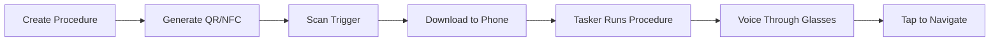

# 🔊 BLISST

**Create and deploy hands-free lists and procedures to your Meta Ray-Ban Smart Glasses**

[](https://your-username.github.io/blisst)
[](LICENSE)
[](https://github.com/your-username/blisst/pulls)

---

## 🎯 Vision

Transform any object into a voice-guided experience. Scan a QR code or NFC tag on devices, recipe books, spare parts, or landmarks to instantly receive voice-guided instructions through your Meta Ray-Ban Smart Glasses. Navigate procedures hands-free using simple taps on your glasses' touch-sensitive arm.

> **Note**: This is a tech demo - please pardon our quirks as we continue improving!

---

## ✨ Features

- 🎧 **Hands-free navigation** via Meta Ray-Ban Smart Glasses
- 📱 **Multiple trigger options**: QR codes, NFC tags, or direct download
- 🌐 **Web-based creator** for easy procedure building
- 🔊 **Voice-guided instructions** with tap-to-advance controls
- 📍 **Geo-locatable procedures** for location-based tasks
- 🛡️ **Content filtering** for safe, appropriate instructions

---

## 🚀 Use Cases

| **Category** | **Example** | **Benefits** |
|---|---|---|
| **🛒 Shopping** | Create shopping lists | Walk through stores hands-free |
| **👨‍🍳 Cooking** | Share recipes | Follow steps without touching devices |
| **💪 Fitness** | Exercise routines | Guided workouts with perfect timing |
| **🏭 Industrial** | Equipment procedures | Safe, hands-free maintenance guides |
| **🚨 Emergency** | Safety instructions | Critical procedures without delay |
| **🎓 Training** | Learning modules | Interactive education for any item |
| **♿ Accessibility** | Voice assistance | Support for various accessibility needs |

---

## 🏗️ How It Works



### Step-by-Step Process

1. **📝 Create** procedures using the BLISST web interface > 
2. **🔗 Generate** unique JSON file and hosting URL
3. **📲 Deploy** via QR code, NFC tag, or direct download
4. **👓 Listen** to instructions through your Ray-Ban glasses
5. **👆 Navigate** by tapping the glasses' touch-sensitive arm

---

## 🔧 Quick Setup

### For Users

#### Prerequisites
- 📱 Android device with Tasker app installed
- 👓 Meta Ray-Ban Smart Glasses
- 🎵 Spotify app (needs to be open during use)

#### Installation Steps

1. **Install Tasker**
   ```
   Download from Google Play Store
   ```

2. **Import BLISST Project**
   - Download `BLISST_Tasker_Project.xml.txt` from this repository
   - In Tasker: Long-press 🏠 → "Import Project" → Select downloaded file
   - Enable the project toggle

3. **You're Ready!** 🎉
   Start scanning QR codes or NFC tags to run procedures

---

## 🌐 Creating Procedures

### Web Interface (Recommended)

1. Visit your GitHub Pages URL > https://oncehadbass.github.io/Meta-Raybans-Procedures/
2. Enter procedure title and steps
3. Click **"Generate Procedure"** to review
4. Click **"Upload & Get Link"** for QR/NFC triggers

### JSON Format

```json
{
  "title": "Coffee Machine Setup",
  "uid": "a1b2c3d4",
  "instructions": [
    { "step": 1, "instruction": "Fill water reservoir with fresh water" },
    { "step": 2, "instruction": "Insert coffee pod into chamber" },
    { "step": 3, "instruction": "Press brew button" }
  ]
}
```

---

## 🔗 Trigger Formats

### QR Code
```
https://your-github-username.github.io/your-repo-name/landing.html?uid=procedure_id&file=file_url
```
*Standard HTTPS link for maximum scanner compatibility*

### NFC Tag
```
procedure_id|https://hosted-file-url.com/procedure_id.json
```
*Pipe-separated string for direct procedure access*

### Direct Download
*Perfect for personal lists created on mobile browsers*

---

## 🏗️ Architecture

### Frontend
- **GitHub Pages** hosting for the web interface
- **Vanilla JavaScript** for procedure creation and management
- **Responsive design** for mobile and desktop

### Backend
- **Glitch proxy server** for JSON file hosting
- **Static file storage** - no code execution
- **Simple REST API** for file uploads

### Mobile Integration
- **Tasker automation** for Android procedure execution
- **Media controls integration** with Ray-Ban glasses
- **Spotify integration** for audio playback routing

---

## 🔒 Security & Quality

- ✅ **Content Filtering**: Built-in profanity filter
- ✅ **Static Hosting**: No server-side code execution
- ✅ **Safe Instructions**: Encouraged clear, concise, safe content
- ✅ **Testing**: Always test procedures before public deployment

---

## 🚀 Self-Hosting (Developers)

### Quick Fork Setup

1. **Fork this repository**
2. **Enable GitHub Pages**
   - Settings → Pages → Deploy from branch (main)
3. **Update URLs in `index.html`**
   ```javascript
   const baseUrl = 'https://YOUR-USERNAME.github.io/YOUR-REPO-NAME';
   ```
4. **(Optional) Custom Backend**
   - Update `proxyUrl` in `handleUpload` function

---

## 🤝 Contributing

We welcome contributions from the community! Here's how you can help:

### 🐛 Bug Reports
- Use [GitHub Issues](../../issues) with detailed descriptions
- Include steps to reproduce and expected behavior

### 💡 Feature Requests  
- Submit via [GitHub Issues](../../issues) with the "enhancement" label
- Describe the use case and potential implementation

### 🔧 Code Contributions
- Fork the repository and create a feature branch
- Submit Pull Requests with clear descriptions
- Follow existing code style and conventions

### 📚 Documentation
- Help improve README, code comments, and user guides
- Add examples and use case documentation

---

## 📄 License

This project is licensed under the MIT License - see the [LICENSE](LICENSE) file for details.

---

## 🌟 Show Your Support

If you find BLISST useful or interesting:

- ⭐ **Star this repository** to help others discover it
- 🍴 **Fork it** to create your own procedures
- 📢 **Share** with the maker and smart glasses community
- 🤝 **Contribute** via issues, discussions, or pull requests

---

<div align="center">

**Made with ❤️ for the maker and smart glasses community**

*Turn any object into a voice-guided experience, one QR code or NFC tag at a time*

[](https://github.com/your-username)
[](https://github.com/your-username/blisst)

</div>
